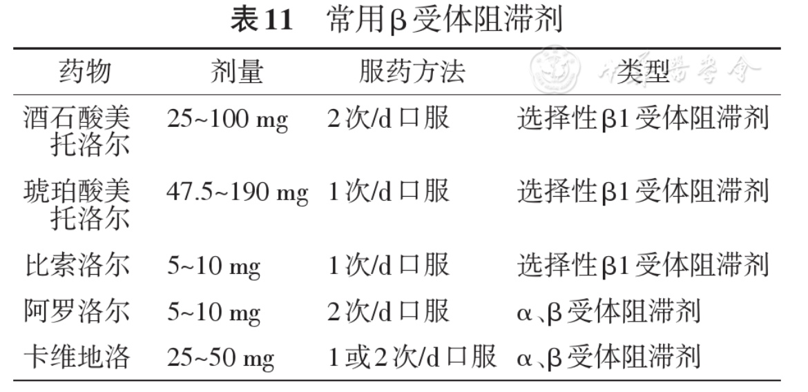

##### 禁忌症
1. 心源性休克，不稳定、失代偿的[心力衰竭](../../../心内科/心力衰竭.md)（肺水肿、低灌注或低血压）
2. 有症状的心动过缓或低血压（P<45次/分或P-Q间>0.24s或收缩压<100mmHg）
3. 严重外周血管疾病患者
##### 注意事项
无肝损、无肾损
##### 机制
通过抑制心脏β1肾上腺素能受体，减慢心率、减弱心肌收缩力、降低血压以减少心肌耗氧量，又可通过延长舒张期以改善心肌灌注。使用期间心率控制在55～60次/分。